# ivis-backend

## Table Of Contents

1. 0.0.1 Entities
   1. lines(Line)
   2. admin_pcs(AdminPc)
   3. cameras(Camera)
   4. rop_verifications(RopVerification)
   5. anpr_captures(AnprCapture)
   6. centres(Centre)
   7. payments(Payment)
   8. roles(Role)
   9. tests(Test)
   10. users(User)
   11. user_sessions(UserSession)
   12. vehicles(Vehicle)
   13. vehicle_records(VehicleRecord)
   14. customers(Customer)
   15. jobs(Job)
   16. appointments(Appointment)
   17. payment_transactions(PaymentTransaction)
2. ER Diagram

## 0.0.1 Entities

### lines(Line)

#### lines(Line) columns

| Database Name | Property Name | Attribute | Type        | Nullable | Charset | Comment |
| ------------- | ------------- | --------- | ----------- | -------- | ------- | ------- |
| id            | id            | PK        | \*bigint    |          |         |         |
| line_id       | line_id       | UK        | \*integer   |          |         |         |
| name          | name          |           | \*varchar   |          |         |         |
| code          | code          | UK        | \*varchar   |          |         |         |
| display_order | display_order |           | \*integer   |          |         |         |
| description   | description   |           | varchar     | Nullable |         |         |
| status        | status        |           | \*varchar   |          |         |         |
| created_by    | created_by    |           | varchar     | Nullable |         |         |
| created_at    | created_at    |           | \*timestamp |          |         |         |
| updated_at    | updated_at    |           | \*timestamp |          |         |         |
| is_deleted    | is_deleted    |           | \*boolean   |          |         |         |

#### lines(Line) indices

| Database Name                  | Property Name                  | Unique | Columns |
| ------------------------------ | ------------------------------ | ------ | ------- |
| IDX_LINE_LINE_ID               | IDX_LINE_LINE_ID               | Unique |         |
| IDX_LINE_CODE                  | IDX_LINE_CODE                  | Unique |         |
| UQ_eec14182e99f033a767b8ed96e1 | UQ_eec14182e99f033a767b8ed96e1 | Unique |         |
| UQ_b6b57955b2cb470f7ac39b390ca | UQ_b6b57955b2cb470f7ac39b390ca | Unique |         |

### admin_pcs(AdminPc)

#### admin_pcs(AdminPc) columns

| Database Name | Property Name | Attribute | Type        | Nullable | Charset | Comment |
| ------------- | ------------- | --------- | ----------- | -------- | ------- | ------- |
| id            | id            | PK        | \*bigint    |          |         |         |
| admin_pc_id   | admin_pc_id   | UK        | \*integer   |          |         |         |
| name          | name          |           | \*varchar   |          |         |         |
| code          | code          | UK        | \*varchar   |          |         |         |
| ip_address    | ip_address    |           | \*varchar   |          |         |         |
| line_id       | line_id       | FK        | \*bigint    |          |         |         |
| description   | description   |           | varchar     | Nullable |         |         |
| status        | status        |           | \*varchar   |          |         |         |
| created_by    | created_by    |           | varchar     | Nullable |         |         |
| created_at    | created_at    |           | \*timestamp |          |         |         |
| updated_at    | updated_at    |           | \*timestamp |          |         |         |
| is_deleted    | is_deleted    |           | \*boolean   |          |         |         |

#### admin_pcs(AdminPc) indices

| Database Name                  | Property Name                  | Unique | Columns |
| ------------------------------ | ------------------------------ | ------ | ------- |
| IDX_ADMIN_PC_ADMIN_PC_ID       | IDX_ADMIN_PC_ADMIN_PC_ID       | Unique |         |
| IDX_ADMIN_PC_CODE              | IDX_ADMIN_PC_CODE              | Unique |         |
| UQ_2b0ed7abe5a943c4134c6a572a4 | UQ_2b0ed7abe5a943c4134c6a572a4 | Unique |         |
| UQ_55dfcb5b21e68160930baddb0af | UQ_55dfcb5b21e68160930baddb0af | Unique |         |

### cameras(Camera)

#### cameras(Camera) columns

| Database Name | Property Name | Attribute | Type        | Nullable | Charset | Comment |
| ------------- | ------------- | --------- | ----------- | -------- | ------- | ------- |
| id            | id            | PK        | \*bigint    |          |         |         |
| camera_id     | camera_id     | UK        | \*integer   |          |         |         |
| name          | name          |           | \*varchar   |          |         |         |
| code          | code          | UK        | \*varchar   |          |         |         |
| type          | type          |           | \*varchar   |          |         |         |
| line_id       | line_id       | FK        | \*bigint    |          |         |         |
| description   | description   |           | varchar     | Nullable |         |         |
| status        | status        |           | \*varchar   |          |         |         |
| created_by    | created_by    |           | varchar     | Nullable |         |         |
| created_at    | created_at    |           | \*timestamp |          |         |         |
| updated_at    | updated_at    |           | \*timestamp |          |         |         |
| is_deleted    | is_deleted    |           | \*boolean   |          |         |         |

#### cameras(Camera) indices

| Database Name                  | Property Name                  | Unique | Columns |
| ------------------------------ | ------------------------------ | ------ | ------- |
| IDX_CAMERA_CAMERA_ID           | IDX_CAMERA_CAMERA_ID           | Unique |         |
| IDX_CAMERA_CODE                | IDX_CAMERA_CODE                | Unique |         |
| UQ_d3472a04550d1674e6d6b0bdece | UQ_d3472a04550d1674e6d6b0bdece | Unique |         |
| UQ_1e2ee97e5c0b3ff0fe391d458bb | UQ_1e2ee97e5c0b3ff0fe391d458bb | Unique |         |

### rop_verifications(RopVerification)

#### rop_verifications(RopVerification) columns

| Database Name       | Property Name       | Attribute | Type          | Nullable | Charset | Comment |
| ------------------- | ------------------- | --------- | ------------- | -------- | ------- | ------- |
| id                  | id                  | PK        | \*bigint      |          |         |         |
| rop_verification_id | rop_verification_id | UK        | \*integer     |          |         |         |
| anpr_capture_id     | anpr_capture_id     | FK        | \*bigint      |          |         |         |
| owner_name          | owner_name          |           | varchar(128)  | Nullable |         |         |
| vehicle_make        | vehicle_make        |           | varchar(64)   | Nullable |         |         |
| vehicle_model       | vehicle_model       |           | varchar(64)   | Nullable |         |         |
| reg_no              | reg_no              |           | varchar(32)   | Nullable |         |         |
| chassis_no          | chassis_no          |           | varchar(64)   | Nullable |         |         |
| insurance           | insurance           |           | varchar(128)  | Nullable |         |         |
| reg_expiry          | reg_expiry          |           | date          | Nullable |         |         |
| fetch_status        | fetch_status        |           | \*varchar(32) |          |         |         |
| created_by          | created_by          |           | varchar       | Nullable |         |         |
| created_at          | created_at          |           | \*timestamp   |          |         |         |
| updated_at          | updated_at          |           | \*timestamp   |          |         |         |
| is_deleted          | is_deleted          |           | \*boolean     |          |         |         |

#### rop_verifications(RopVerification) indices

| Database Name                                | Property Name                                | Unique | Columns |
| -------------------------------------------- | -------------------------------------------- | ------ | ------- |
| IDX_ROP_VERIFICATION_FETCH_STATUS_CREATED_AT | IDX_ROP_VERIFICATION_FETCH_STATUS_CREATED_AT |        |         |
| IDX_ROP_VERIFICATION_ANPR_CAPTURE_ID         | IDX_ROP_VERIFICATION_ANPR_CAPTURE_ID         |        |         |
| IDX_ROP_VERIFICATION_ROP_VERIFICATION_ID     | IDX_ROP_VERIFICATION_ROP_VERIFICATION_ID     | Unique |         |
| UQ_c561ca5d7e8870d374cd4dbd5cf               | UQ_c561ca5d7e8870d374cd4dbd5cf               | Unique |         |

### anpr_captures(AnprCapture)

#### anpr_captures(AnprCapture) columns

| Database Name       | Property Name       | Attribute | Type          | Nullable | Charset | Comment |
| ------------------- | ------------------- | --------- | ------------- | -------- | ------- | ------- |
| id                  | id                  | PK        | \*bigint      |          |         |         |
| anpr_capture_id     | anpr_capture_id     | UK        | \*integer     |          |         |         |
| plate_number        | plate_number        | UK        | \*varchar(32) |          |         |         |
| normalized_plate    | normalized_plate    |           | varchar(32)   | Nullable |         |         |
| plate_confidence    | plate_confidence    |           | numeric       | Nullable |         |         |
| capture_time        | capture_time        | UK        | \*timestamp   |          |         |         |
| camera_id           | camera_id           | FK,UK     | \*bigint      |          |         |         |
| lane                | lane                |           | varchar(32)   | Nullable |         |         |
| direction           | direction           |           | varchar(32)   | Nullable |         |         |
| country_code        | country_code        |           | varchar(8)    | Nullable |         |         |
| plate_color         | plate_color         |           | varchar(32)   | Nullable |         |         |
| vehicle_type        | vehicle_type        |           | varchar(64)   | Nullable |         |         |
| vehicle_color       | vehicle_color       |           | varchar(64)   | Nullable |         |         |
| image_url           | image_url           |           | varchar       | Nullable |         |         |
| verification_status | verification_status |           | \*varchar     |          |         |         |
| raw_payload         | raw_payload         |           | jsonb         | Nullable |         |         |
| created_by          | created_by          |           | varchar       | Nullable |         |         |
| created_at          | created_at          |           | \*timestamp   |          |         |         |
| updated_at          | updated_at          |           | \*timestamp   |          |         |         |
| is_deleted          | is_deleted          |           | \*boolean     |          |         |         |

#### anpr_captures(AnprCapture) indices

| Database Name                     | Property Name                     | Unique | Columns |
| --------------------------------- | --------------------------------- | ------ | ------- |
| UQ_ANPR_CAPTURE_CAMERA_PLATE_TIME | UQ_ANPR_CAPTURE_CAMERA_PLATE_TIME | Unique |         |
| IDX_ANPR_CAPTURE_CAMERA_TIME      | IDX_ANPR_CAPTURE_CAMERA_TIME      |        |         |
| IDX_ANPR_CAPTURE_PLATE_TIME       | IDX_ANPR_CAPTURE_PLATE_TIME       |        |         |
| IDX_ANPR_CAPTURE_ANPR_CAPTURE_ID  | IDX_ANPR_CAPTURE_ANPR_CAPTURE_ID  | Unique |         |
| UQ_3733f87c44bfab4fea8d88ee7a1    | UQ_3733f87c44bfab4fea8d88ee7a1    | Unique |         |

### centres(Centre)

#### centres(Centre) columns

| Database Name | Property Name | Attribute | Type        | Nullable | Charset | Comment |
| ------------- | ------------- | --------- | ----------- | -------- | ------- | ------- |
| id            | id            | PK        | \*bigint    |          |         |         |
| centre_id     | centre_id     | UK        | \*integer   |          |         |         |
| name          | name          |           | \*varchar   |          |         |         |
| code          | code          | UK        | \*varchar   |          |         |         |
| description   | description   |           | varchar     | Nullable |         |         |
| status        | status        |           | \*varchar   |          |         |         |
| created_by    | created_by    |           | varchar     | Nullable |         |         |
| created_at    | created_at    |           | \*timestamp |          |         |         |
| updated_at    | updated_at    |           | \*timestamp |          |         |         |
| is_deleted    | is_deleted    |           | \*boolean   |          |         |         |

#### centres(Centre) indices

| Database Name                  | Property Name                  | Unique | Columns |
| ------------------------------ | ------------------------------ | ------ | ------- |
| IDX_CENTRE_CENTRE_ID           | IDX_CENTRE_CENTRE_ID           | Unique |         |
| IDX_CENTRE_CODE                | IDX_CENTRE_CODE                | Unique |         |
| UQ_52c7de498d1139ed0aa79eb9cf9 | UQ_52c7de498d1139ed0aa79eb9cf9 | Unique |         |
| UQ_23a35b598b2bc329d06ddb3eb6f | UQ_23a35b598b2bc329d06ddb3eb6f | Unique |         |

### payments(Payment)

#### payments(Payment) columns

| Database Name | Property Name | Attribute | Type        | Nullable | Charset | Comment |
| ------------- | ------------- | --------- | ----------- | -------- | ------- | ------- |
| id            | id            | PK        | \*bigint    |          |         |         |
| payment_id    | payment_id    | UK        | \*integer   |          |         |         |
| name          | name          |           | \*varchar   |          |         |         |
| code          | code          | UK        | \*varchar   |          |         |         |
| status        | status        |           | \*varchar   |          |         |         |
| created_by    | created_by    |           | varchar     | Nullable |         |         |
| created_at    | created_at    |           | \*timestamp |          |         |         |
| updated_at    | updated_at    |           | \*timestamp |          |         |         |
| is_deleted    | is_deleted    |           | \*boolean   |          |         |         |

#### payments(Payment) indices

| Database Name                  | Property Name                  | Unique | Columns |
| ------------------------------ | ------------------------------ | ------ | ------- |
| IDX_PAYMENT_PAYMENT_ID         | IDX_PAYMENT_PAYMENT_ID         | Unique |         |
| IDX_PAYMENT_CODE               | IDX_PAYMENT_CODE               | Unique |         |
| UQ_8866a3cfff96b8e17c2b204aae0 | UQ_8866a3cfff96b8e17c2b204aae0 | Unique |         |
| UQ_2b3c754ea3bf83cab000b8ed3d4 | UQ_2b3c754ea3bf83cab000b8ed3d4 | Unique |         |

### roles(Role)

#### roles(Role) columns

| Database Name | Property Name | Attribute | Type        | Nullable | Charset | Comment |
| ------------- | ------------- | --------- | ----------- | -------- | ------- | ------- |
| id            | id            | PK        | \*bigint    |          |         |         |
| role_id       | role_id       | UK        | \*integer   |          |         |         |
| role_name     | role_name     | UK        | \*varchar   |          |         |         |
| description   | description   |           | varchar     | Nullable |         |         |
| created_by    | created_by    |           | varchar     | Nullable |         |         |
| created_at    | created_at    |           | \*timestamp |          |         |         |
| updated_at    | updated_at    |           | \*timestamp |          |         |         |
| is_deleted    | is_deleted    |           | \*boolean   |          |         |         |

#### roles(Role) indices

| Database Name                  | Property Name                  | Unique | Columns |
| ------------------------------ | ------------------------------ | ------ | ------- |
| IDX_ROLE_ROLE_CODE             | IDX_ROLE_ROLE_CODE             | Unique |         |
| IDX_ROLE_ROLE_NAME             | IDX_ROLE_ROLE_NAME             | Unique |         |
| UQ_09f4c8130b54f35925588a37b6a | UQ_09f4c8130b54f35925588a37b6a | Unique |         |
| UQ_ac35f51a0f17e3e1fe121126039 | UQ_ac35f51a0f17e3e1fe121126039 | Unique |         |

### tests(Test)

#### tests(Test) columns

| Database Name | Property Name | Attribute | Type        | Nullable | Charset | Comment |
| ------------- | ------------- | --------- | ----------- | -------- | ------- | ------- |
| id            | id            | PK        | \*bigint    |          |         |         |
| test_id       | test_id       | UK        | \*integer   |          |         |         |
| name          | name          |           | \*varchar   |          |         |         |
| code          | code          | UK        | \*varchar   |          |         |         |
| status        | status        |           | \*varchar   |          |         |         |
| created_by    | created_by    |           | varchar     | Nullable |         |         |
| created_at    | created_at    |           | \*timestamp |          |         |         |
| updated_at    | updated_at    |           | \*timestamp |          |         |         |
| is_deleted    | is_deleted    |           | \*boolean   |          |         |         |

#### tests(Test) indices

| Database Name                  | Property Name                  | Unique | Columns |
| ------------------------------ | ------------------------------ | ------ | ------- |
| IDX_TEST_TEST_ID               | IDX_TEST_TEST_ID               | Unique |         |
| IDX_TEST_CODE                  | IDX_TEST_CODE                  | Unique |         |
| UQ_f8c701fbb2c6f4fb85cebfa0000 | UQ_f8c701fbb2c6f4fb85cebfa0000 | Unique |         |
| UQ_b893c790beecd29d06029e4d2b0 | UQ_b893c790beecd29d06029e4d2b0 | Unique |         |

### users(User)

#### users(User) columns

| Database Name | Property Name | Attribute | Type        | Nullable | Charset | Comment |
| ------------- | ------------- | --------- | ----------- | -------- | ------- | ------- |
| id            | id            | PK        | \*bigint    |          |         |         |
| user_id       | user_id       | UK        | \*integer   |          |         |         |
| user_name     | user_name     |           | \*varchar   |          |         |         |
| email         | email         | UK        | \*varchar   |          |         |         |
| password      | password      |           | varchar     | Nullable |         |         |
| role_id       | role_id       | FK        | \*bigint    |          |         |         |
| center_id     | center_id     | FK        | bigint      | Nullable |         |         |
| line_id       | line_id       | FK        | bigint      | Nullable |         |         |
| created_by    | created_by    |           | varchar     | Nullable |         |         |
| created_at    | created_at    |           | \*timestamp |          |         |         |
| updated_at    | updated_at    |           | \*timestamp |          |         |         |
| is_deleted    | is_deleted    |           | \*boolean   |          |         |         |

#### users(User) indices

| Database Name                  | Property Name                  | Unique | Columns |
| ------------------------------ | ------------------------------ | ------ | ------- |
| IDX_USER_USER_ID               | IDX_USER_USER_ID               | Unique |         |
| IDX_USER_EMAIL                 | IDX_USER_EMAIL                 | Unique |         |
| UQ_96aac72f1574b88752e9fb00089 | UQ_96aac72f1574b88752e9fb00089 | Unique |         |
| UQ_97672ac88f789774dd47f7c8be3 | UQ_97672ac88f789774dd47f7c8be3 | Unique |         |

### user_sessions(UserSession)

#### user_sessions(UserSession) columns

| Database Name     | Property Name     | Attribute | Type        | Nullable | Charset | Comment |
| ----------------- | ----------------- | --------- | ----------- | -------- | ------- | ------- |
| id                | id                | PK        | \*bigint    |          |         |         |
| user_id           | user_id           | FK        | \*bigint    |          |         |         |
| access_token_jti  | access_token_jti  |           | \*varchar   |          |         |         |
| refresh_token_jti | refresh_token_jti |           | \*varchar   |          |         |         |
| refresh_token     | refresh_token     |           | \*varchar   |          |         |         |
| is_active         | is_active         |           | \*boolean   |          |         |         |
| expired_at        | expired_at        |           | \*timestamp |          |         |         |
| last_refreshed_at | last_refreshed_at |           | timestamp   | Nullable |         |         |
| metadata          | metadata          |           | jsonb       | Nullable |         |         |
| created_by        | created_by        |           | varchar     | Nullable |         |         |
| created_at        | created_at        |           | \*timestamp |          |         |         |
| updated_at        | updated_at        |           | \*timestamp |          |         |         |

#### user_sessions(UserSession) indices

| Database Name              | Property Name              | Unique | Columns |
| -------------------------- | -------------------------- | ------ | ------- |
| IDX_user_sessions_user_jti | IDX_user_sessions_user_jti |        |         |

### vehicles(Vehicle)

#### vehicles(Vehicle) columns

| Database Name | Property Name | Attribute | Type           | Nullable | Charset | Comment |
| ------------- | ------------- | --------- | -------------- | -------- | ------- | ------- |
| id            | id            | PK        | \*bigint       |          |         |         |
| vehicle_id    | vehicle_id    | UK        | \*integer      |          |         |         |
| name          | name          |           | \*varchar(128) |          |         |         |
| code          | code          | UK        | \*varchar(64)  |          |         |         |
| vin_no        | vin_no        |           | varchar(64)    | Nullable |         |         |
| description   | description   |           | varchar(512)   | Nullable |         |         |
| status        | status        |           | \*varchar(32)  |          |         |         |
| created_by    | created_by    |           | varchar        | Nullable |         |         |
| created_at    | created_at    |           | \*timestamp    |          |         |         |
| updated_at    | updated_at    |           | \*timestamp    |          |         |         |
| is_deleted    | is_deleted    |           | \*boolean      |          |         |         |

#### vehicles(Vehicle) indices

| Database Name                  | Property Name                  | Unique | Columns |
| ------------------------------ | ------------------------------ | ------ | ------- |
| IDX_VEHICLE_CODE               | IDX_VEHICLE_CODE               | Unique |         |
| IDX_VEHICLE_VEHICLE_ID         | IDX_VEHICLE_VEHICLE_ID         | Unique |         |
| UQ_daf0b353d75b92156fdbe18791e | UQ_daf0b353d75b92156fdbe18791e | Unique |         |

### vehicle_records(VehicleRecord)

#### vehicle_records(VehicleRecord) columns

| Database Name     | Property Name     | Attribute | Type          | Nullable | Charset | Comment |
| ----------------- | ----------------- | --------- | ------------- | -------- | ------- | ------- |
| id                | id                | PK        | \*bigint      |          |         |         |
| vehicle_record_id | vehicle_record_id | UK        | \*integer     |          |         |         |
| plate_number      | plate_number      | UK        | \*varchar(32) |          |         |         |
| chassis_no        | chassis_no        |           | varchar(64)   | Nullable |         |         |
| vehicle_make      | vehicle_make      |           | varchar(64)   | Nullable |         |         |
| vehicle_model     | vehicle_model     |           | varchar(64)   | Nullable |         |         |
| vehicle_type      | vehicle_type      |           | varchar(64)   | Nullable |         |         |
| plate_color       | plate_color       |           | varchar(64)   | Nullable |         |         |
| vehicle_color     | vehicle_color     |           | varchar(64)   | Nullable |         |         |
| vehicle_master_id | vehicle_master_id | FK        | bigint        | Nullable |         |         |
| created_by        | created_by        |           | varchar       | Nullable |         |         |
| created_at        | created_at        |           | \*timestamp   |          |         |         |
| updated_at        | updated_at        |           | \*timestamp   |          |         |         |
| is_deleted        | is_deleted        |           | \*boolean     |          |         |         |

#### vehicle_records(VehicleRecord) indices

| Database Name                        | Property Name                        | Unique | Columns |
| ------------------------------------ | ------------------------------------ | ------ | ------- |
| IDX_VEHICLE_RECORD_VEHICLE_MASTER_ID | IDX_VEHICLE_RECORD_VEHICLE_MASTER_ID |        |         |
| IDX_VEHICLE_RECORD_CHASSIS_NO        | IDX_VEHICLE_RECORD_CHASSIS_NO        |        |         |
| IDX_VEHICLE_RECORD_PLATE_NUMBER      | IDX_VEHICLE_RECORD_PLATE_NUMBER      | Unique |         |
| IDX_VEHICLE_RECORD_VEHICLE_RECORD_ID | IDX_VEHICLE_RECORD_VEHICLE_RECORD_ID | Unique |         |
| UQ_7d760d044a09daf4e109c7afe8f       | UQ_7d760d044a09daf4e109c7afe8f       | Unique |         |

### customers(Customer)

#### customers(Customer) columns

| Database Name             | Property Name             | Attribute | Type           | Nullable | Charset | Comment |
| ------------------------- | ------------------------- | --------- | -------------- | -------- | ------- | ------- |
| id                        | id                        | PK        | \*bigint       |          |         |         |
| customer_id               | customer_id               | UK        | \*integer      |          |         |         |
| name                      | name                      |           | \*varchar(128) |          |         |         |
| phone                     | phone                     |           | \*varchar(32)  |          |         |         |
| owner_name                | owner_name                |           | varchar(128)   | Nullable |         |         |
| id_number                 | id_number                 |           | varchar(64)    | Nullable |         |         |
| primary_vehicle_record_id | primary_vehicle_record_id | FK        | bigint         | Nullable |         |         |
| created_by                | created_by                |           | varchar        | Nullable |         |         |
| created_at                | created_at                |           | \*timestamp    |          |         |         |
| updated_at                | updated_at                |           | \*timestamp    |          |         |         |
| is_deleted                | is_deleted                |           | \*boolean      |          |         |         |

#### customers(Customer) indices

| Database Name                          | Property Name                          | Unique | Columns |
| -------------------------------------- | -------------------------------------- | ------ | ------- |
| IDX_CUSTOMER_PRIMARY_VEHICLE_RECORD_ID | IDX_CUSTOMER_PRIMARY_VEHICLE_RECORD_ID |        |         |
| IDX_CUSTOMER_ID_NUMBER                 | IDX_CUSTOMER_ID_NUMBER                 |        |         |
| IDX_CUSTOMER_PHONE                     | IDX_CUSTOMER_PHONE                     |        |         |
| IDX_CUSTOMER_CUSTOMER_ID               | IDX_CUSTOMER_CUSTOMER_ID               | Unique |         |
| UQ_6c444ce6637f2c1d71c3cf136c1         | UQ_6c444ce6637f2c1d71c3cf136c1         | Unique |         |

### jobs(Job)

#### jobs(Job) columns

| Database Name     | Property Name     | Attribute | Type          | Nullable | Charset | Comment |
| ----------------- | ----------------- | --------- | ------------- | -------- | ------- | ------- |
| id                | id                | PK        | \*bigint      |          |         |         |
| job_id            | job_id            | UK        | \*integer     |          |         |         |
| status            | status            |           | \*varchar(32) |          |         |         |
| source            | source            |           | \*varchar(32) |          |         |         |
| customer_id       | customer_id       | FK        | \*bigint      |          |         |         |
| vehicle_record_id | vehicle_record_id | FK        | \*bigint      |          |         |         |
| anpr_capture_id   | anpr_capture_id   | FK        | bigint        | Nullable |         |         |
| centre_id         | centre_id         | FK        | bigint        | Nullable |         |         |
| line_id           | line_id           | FK        | bigint        | Nullable |         |         |
| admin_pc_id       | admin_pc_id       | FK        | bigint        | Nullable |         |         |
| camera_id         | camera_id         | FK        | bigint        | Nullable |         |         |
| overall_result    | overall_result    |           | varchar(16)   | Nullable |         |         |
| infile_name       | infile_name       |           | varchar(256)  | Nullable |         |         |
| infile_path       | infile_path       |           | varchar(512)  | Nullable |         |         |
| outfile_name      | outfile_name      |           | varchar(256)  | Nullable |         |         |
| outfile_path      | outfile_path      |           | varchar(512)  | Nullable |         |         |
| started_at        | started_at        |           | timestamp     | Nullable |         |         |
| completed_at      | completed_at      |           | timestamp     | Nullable |         |         |
| created_by        | created_by        |           | varchar       | Nullable |         |         |
| created_at        | created_at        |           | \*timestamp   |          |         |         |
| updated_at        | updated_at        |           | \*timestamp   |          |         |         |
| is_deleted        | is_deleted        |           | \*boolean     |          |         |         |

#### jobs(Job) indices

| Database Name                  | Property Name                  | Unique | Columns |
| ------------------------------ | ------------------------------ | ------ | ------- |
| IDX_JOB_CENTRE_LINE            | IDX_JOB_CENTRE_LINE            |        |         |
| IDX_JOB_VEHICLE_RECORD_ID      | IDX_JOB_VEHICLE_RECORD_ID      |        |         |
| IDX_JOB_CUSTOMER_ID            | IDX_JOB_CUSTOMER_ID            |        |         |
| IDX_JOB_STATUS_CREATED_AT      | IDX_JOB_STATUS_CREATED_AT      |        |         |
| IDX_JOB_JOB_ID                 | IDX_JOB_JOB_ID                 | Unique |         |
| UQ_75f2e130e4b1372fea0b6248a17 | UQ_75f2e130e4b1372fea0b6248a17 | Unique |         |

### appointments(Appointment)

#### appointments(Appointment) columns

| Database Name     | Property Name     | Attribute | Type          | Nullable | Charset | Comment |
| ----------------- | ----------------- | --------- | ------------- | -------- | ------- | ------- |
| id                | id                | PK        | \*bigint      |          |         |         |
| appointment_id    | appointment_id    | UK        | \*integer     |          |         |         |
| anpr_capture_id   | anpr_capture_id   | FK        | bigint        | Nullable |         |         |
| customer_id       | customer_id       | FK        | bigint        | Nullable |         |         |
| vehicle_record_id | vehicle_record_id | FK        | bigint        | Nullable |         |         |
| centre_id         | centre_id         | FK        | bigint        | Nullable |         |         |
| line_id           | line_id           | FK        | bigint        | Nullable |         |         |
| plate_number      | plate_number      |           | varchar(32)   | Nullable |         |         |
| customer_name     | customer_name     |           | varchar(128)  | Nullable |         |         |
| customer_phone    | customer_phone    |           | varchar(32)   | Nullable |         |         |
| id_number         | id_number         |           | varchar(64)   | Nullable |         |         |
| appointment_at    | appointment_at    |           | \*timestamp   |          |         |         |
| status            | status            |           | \*varchar(32) |          |         |         |
| notes             | notes             |           | varchar(512)  | Nullable |         |         |
| created_by        | created_by        |           | varchar       | Nullable |         |         |
| created_at        | created_at        |           | \*timestamp   |          |         |         |
| updated_at        | updated_at        |           | \*timestamp   |          |         |         |
| is_deleted        | is_deleted        |           | \*boolean     |          |         |         |

#### appointments(Appointment) indices

| Database Name                   | Property Name                   | Unique | Columns |
| ------------------------------- | ------------------------------- | ------ | ------- |
| IDX_APPOINTMENT_ANPR_CAPTURE_ID | IDX_APPOINTMENT_ANPR_CAPTURE_ID |        |         |
| IDX_APPOINTMENT_CUSTOMER_ID     | IDX_APPOINTMENT_CUSTOMER_ID     |        |         |
| IDX_APPOINTMENT_APPOINTMENT_ID  | IDX_APPOINTMENT_APPOINTMENT_ID  | Unique |         |
| UQ_dde485d1b7ca51845c075befb6b  | UQ_dde485d1b7ca51845c075befb6b  | Unique |         |

### payment_transactions(PaymentTransaction)

#### payment_transactions(PaymentTransaction) columns

| Database Name          | Property Name          | Attribute | Type          | Nullable | Charset | Comment |
| ---------------------- | ---------------------- | --------- | ------------- | -------- | ------- | ------- |
| id                     | id                     | PK        | \*bigint      |          |         |         |
| payment_transaction_id | payment_transaction_id | UK        | \*integer     |          |         |         |
| appointment_id         | appointment_id         | FK        | bigint        | Nullable |         |         |
| customer_id            | customer_id            | FK        | \*bigint      |          |         |         |
| vehicle_record_id      | vehicle_record_id      | FK        | \*bigint      |          |         |         |
| job_id                 | job_id                 | FK        | bigint        | Nullable |         |         |
| anpr_capture_id        | anpr_capture_id        | FK        | bigint        | Nullable |         |         |
| centre_id              | centre_id              | FK        | bigint        | Nullable |         |         |
| line_id                | line_id                | FK        | bigint        | Nullable |         |         |
| admin_pc_id            | admin_pc_id            | FK        | bigint        | Nullable |         |         |
| camera_id              | camera_id              | FK        | bigint        | Nullable |         |         |
| payment_type           | payment_type           |           | \*varchar(32) |          |         |         |
| status                 | status                 |           | \*varchar(32) |          |         |         |
| charges                | charges                |           | \*numeric     |          |         |         |
| vat                    | vat                    |           | \*numeric     |          |         |         |
| grand_total            | grand_total            |           | \*numeric     |          |         |         |
| pay_date               | pay_date               |           | timestamp     | Nullable |         |         |
| created_by             | created_by             |           | varchar       | Nullable |         |         |
| created_at             | created_at             |           | \*timestamp   |          |         |         |
| updated_at             | updated_at             |           | \*timestamp   |          |         |         |
| is_deleted             | is_deleted             |           | \*boolean     |          |         |         |

#### payment_transactions(PaymentTransaction) indices

| Database Name                                  | Property Name                                  | Unique | Columns |
| ---------------------------------------------- | ---------------------------------------------- | ------ | ------- |
| IDX_PAYMENT_TRANSACTION_CUSTOMER_ID            | IDX_PAYMENT_TRANSACTION_CUSTOMER_ID            |        |         |
| IDX_PAYMENT_TRANSACTION_STATUS                 | IDX_PAYMENT_TRANSACTION_STATUS                 |        |         |
| IDX_PAYMENT_TRANSACTION_PAYMENT_TRANSACTION_ID | IDX_PAYMENT_TRANSACTION_PAYMENT_TRANSACTION_ID | Unique |         |
| UQ_5c9c6517719d848401df23eb66e                 | UQ_5c9c6517719d848401df23eb66e                 | Unique |         |

## ER Diagram

```mermaid
%%{init: {'theme':'dark'}}%%

erDiagram


"lines(Line)" {
  *bigint id    PK
  *integer line_id    UK
  *varchar name
  *varchar code    UK
  *integer display_order
  varchar description
  *varchar status
  varchar created_by
  *timestamp created_at
  *timestamp updated_at
  *boolean is_deleted
}




"admin_pcs(AdminPc)" {
  *bigint id    PK
  *integer admin_pc_id    UK
  *varchar name
  *varchar code    UK
  *varchar ip_address
  *bigint line_id    FK
  varchar description
  *varchar status
  varchar created_by
  *timestamp created_at
  *timestamp updated_at
  *boolean is_deleted
}


"admin_pcs(AdminPc)"  }|  --  ||  "lines(Line)":  "line_id"


"cameras(Camera)" {
  *bigint id    PK
  *integer camera_id    UK
  *varchar name
  *varchar code    UK
  *varchar type
  *bigint line_id    FK
  varchar description
  *varchar status
  varchar created_by
  *timestamp created_at
  *timestamp updated_at
  *boolean is_deleted
}


"cameras(Camera)"  }|  --  ||  "lines(Line)":  "line_id"


"rop_verifications(RopVerification)" {
  *bigint id    PK
  *integer rop_verification_id    UK
  *bigint anpr_capture_id    FK
  varchar(128) owner_name
  varchar(64) vehicle_make
  varchar(64) vehicle_model
  varchar(32) reg_no
  varchar(64) chassis_no
  varchar(128) insurance
  date reg_expiry
  *varchar(32) fetch_status
  varchar created_by
  *timestamp created_at
  *timestamp updated_at
  *boolean is_deleted
}


"rop_verifications(RopVerification)"  }|  --  ||  "anpr_captures(AnprCapture)":  "anpr_capture_id"


"anpr_captures(AnprCapture)" {
  *bigint id    PK
  *integer anpr_capture_id    UK
  *varchar(32) plate_number    UK
  varchar(32) normalized_plate
  numeric plate_confidence
  *timestamp capture_time    UK
  *bigint camera_id    FK,UK
  varchar(32) lane
  varchar(32) direction
  varchar(8) country_code
  varchar(32) plate_color
  varchar(64) vehicle_type
  varchar(64) vehicle_color
  varchar image_url
  *varchar verification_status
  jsonb raw_payload
  varchar created_by
  *timestamp created_at
  *timestamp updated_at
  *boolean is_deleted
}


"anpr_captures(AnprCapture)"  }|  --  ||  "cameras(Camera)":  "camera_id"


"centres(Centre)" {
  *bigint id    PK
  *integer centre_id    UK
  *varchar name
  *varchar code    UK
  varchar description
  *varchar status
  varchar created_by
  *timestamp created_at
  *timestamp updated_at
  *boolean is_deleted
}




"payments(Payment)" {
  *bigint id    PK
  *integer payment_id    UK
  *varchar name
  *varchar code    UK
  *varchar status
  varchar created_by
  *timestamp created_at
  *timestamp updated_at
  *boolean is_deleted
}




"roles(Role)" {
  *bigint id    PK
  *integer role_id    UK
  *varchar role_name    UK
  varchar description
  varchar created_by
  *timestamp created_at
  *timestamp updated_at
  *boolean is_deleted
}




"tests(Test)" {
  *bigint id    PK
  *integer test_id    UK
  *varchar name
  *varchar code    UK
  *varchar status
  varchar created_by
  *timestamp created_at
  *timestamp updated_at
  *boolean is_deleted
}




"users(User)" {
  *bigint id    PK
  *integer user_id    UK
  *varchar user_name
  *varchar email    UK
  varchar password
  *bigint role_id    FK
  bigint center_id    FK
  bigint line_id    FK
  varchar created_by
  *timestamp created_at
  *timestamp updated_at
  *boolean is_deleted
}


"users(User)"  }|  --  ||  "roles(Role)":  "role_id"
"users(User)"  }o  --  o|  "centres(Centre)":  "center_id"
"users(User)"  }o  --  o|  "lines(Line)":  "line_id"


"user_sessions(UserSession)" {
  *bigint id    PK
  *bigint user_id    FK
  *varchar access_token_jti
  *varchar refresh_token_jti
  *varchar refresh_token
  *boolean is_active
  *timestamp expired_at
  timestamp last_refreshed_at
  jsonb metadata
  varchar created_by
  *timestamp created_at
  *timestamp updated_at
}


"user_sessions(UserSession)"  }o  --  ||  "users(User)":  "user_id"


"vehicles(Vehicle)" {
  *bigint id    PK
  *integer vehicle_id    UK
  *varchar(128) name
  *varchar(64) code    UK
  varchar(64) vin_no
  varchar(512) description
  *varchar(32) status
  varchar created_by
  *timestamp created_at
  *timestamp updated_at
  *boolean is_deleted
}




"vehicle_records(VehicleRecord)" {
  *bigint id    PK
  *integer vehicle_record_id    UK
  *varchar(32) plate_number    UK
  varchar(64) chassis_no
  varchar(64) vehicle_make
  varchar(64) vehicle_model
  varchar(64) vehicle_type
  varchar(64) plate_color
  varchar(64) vehicle_color
  bigint vehicle_master_id    FK
  varchar created_by
  *timestamp created_at
  *timestamp updated_at
  *boolean is_deleted
}


"vehicle_records(VehicleRecord)"  }o  --  o|  "vehicles(Vehicle)":  "vehicle_master_id"


"customers(Customer)" {
  *bigint id    PK
  *integer customer_id    UK
  *varchar(128) name
  *varchar(32) phone
  varchar(128) owner_name
  varchar(64) id_number
  bigint primary_vehicle_record_id    FK
  varchar created_by
  *timestamp created_at
  *timestamp updated_at
  *boolean is_deleted
}


"customers(Customer)"  }o  --  o|  "vehicle_records(VehicleRecord)":  "primary_vehicle_record_id"


"jobs(Job)" {
  *bigint id    PK
  *integer job_id    UK
  *varchar(32) status
  *varchar(32) source
  *bigint customer_id    FK
  *bigint vehicle_record_id    FK
  bigint anpr_capture_id    FK
  bigint centre_id    FK
  bigint line_id    FK
  bigint admin_pc_id    FK
  bigint camera_id    FK
  varchar(16) overall_result
  varchar(256) infile_name
  varchar(512) infile_path
  varchar(256) outfile_name
  varchar(512) outfile_path
  timestamp started_at
  timestamp completed_at
  varchar created_by
  *timestamp created_at
  *timestamp updated_at
  *boolean is_deleted
}


"jobs(Job)"  }|  --  ||  "customers(Customer)":  "customer_id"
"jobs(Job)"  }|  --  ||  "vehicle_records(VehicleRecord)":  "vehicle_record_id"
"jobs(Job)"  }o  --  o|  "anpr_captures(AnprCapture)":  "anpr_capture_id"
"jobs(Job)"  }o  --  o|  "centres(Centre)":  "centre_id"
"jobs(Job)"  }o  --  o|  "lines(Line)":  "line_id"
"jobs(Job)"  }o  --  o|  "admin_pcs(AdminPc)":  "admin_pc_id"
"jobs(Job)"  }o  --  o|  "cameras(Camera)":  "camera_id"


"appointments(Appointment)" {
  *bigint id    PK
  *integer appointment_id    UK
  bigint anpr_capture_id    FK
  bigint customer_id    FK
  bigint vehicle_record_id    FK
  bigint centre_id    FK
  bigint line_id    FK
  varchar(32) plate_number
  varchar(128) customer_name
  varchar(32) customer_phone
  varchar(64) id_number
  *timestamp appointment_at
  *varchar(32) status
  varchar(512) notes
  varchar created_by
  *timestamp created_at
  *timestamp updated_at
  *boolean is_deleted
}


"appointments(Appointment)"  }o  --  o|  "anpr_captures(AnprCapture)":  "anpr_capture_id"
"appointments(Appointment)"  }o  --  o|  "customers(Customer)":  "customer_id"
"appointments(Appointment)"  }o  --  o|  "vehicle_records(VehicleRecord)":  "vehicle_record_id"
"appointments(Appointment)"  }o  --  o|  "centres(Centre)":  "centre_id"
"appointments(Appointment)"  }o  --  o|  "lines(Line)":  "line_id"


"payment_transactions(PaymentTransaction)" {
  *bigint id    PK
  *integer payment_transaction_id    UK
  bigint appointment_id    FK
  *bigint customer_id    FK
  *bigint vehicle_record_id    FK
  bigint job_id    FK
  bigint anpr_capture_id    FK
  bigint centre_id    FK
  bigint line_id    FK
  bigint admin_pc_id    FK
  bigint camera_id    FK
  *varchar(32) payment_type
  *varchar(32) status
  *numeric charges
  *numeric vat
  *numeric grand_total
  timestamp pay_date
  varchar created_by
  *timestamp created_at
  *timestamp updated_at
  *boolean is_deleted
}


"payment_transactions(PaymentTransaction)"  }o  --  o|  "appointments(Appointment)":  "appointment_id"
"payment_transactions(PaymentTransaction)"  }|  --  ||  "customers(Customer)":  "customer_id"
"payment_transactions(PaymentTransaction)"  }|  --  ||  "vehicle_records(VehicleRecord)":  "vehicle_record_id"
"payment_transactions(PaymentTransaction)"  }o  --  o|  "jobs(Job)":  "job_id"
"payment_transactions(PaymentTransaction)"  }o  --  o|  "anpr_captures(AnprCapture)":  "anpr_capture_id"
"payment_transactions(PaymentTransaction)"  }o  --  o|  "centres(Centre)":  "centre_id"
"payment_transactions(PaymentTransaction)"  }o  --  o|  "lines(Line)":  "line_id"
"payment_transactions(PaymentTransaction)"  }o  --  o|  "admin_pcs(AdminPc)":  "admin_pc_id"
"payment_transactions(PaymentTransaction)"  }o  --  o|  "cameras(Camera)":  "camera_id"

```

